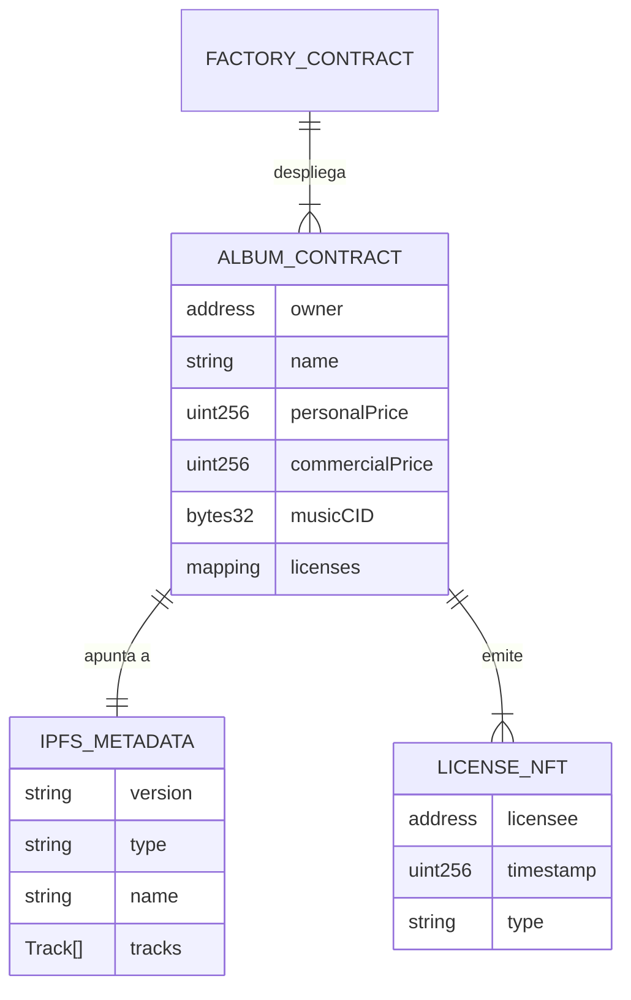
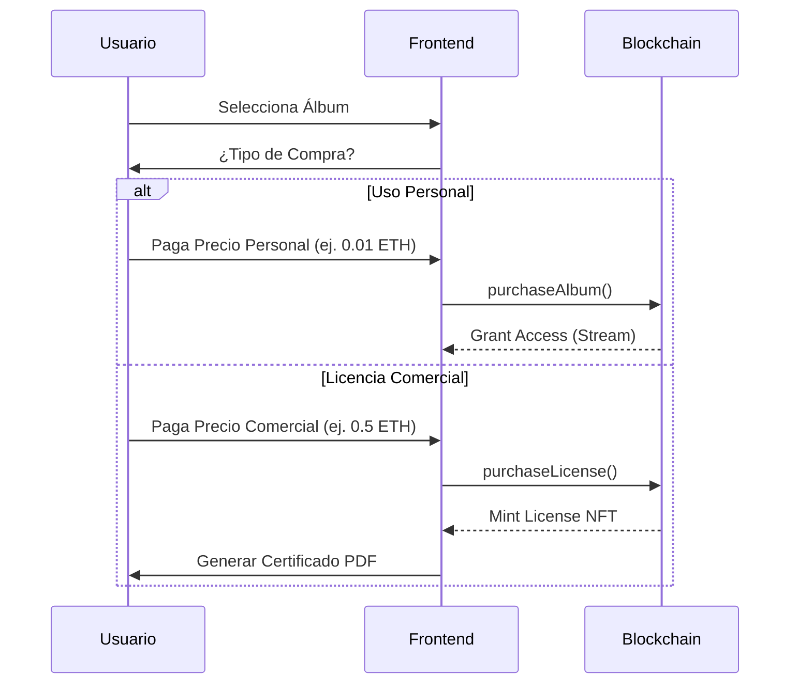

# Documentación Técnica: SmartRoyalty Protocol

## 1. Resumen Ejecutivo
SmartRoyalty es una plataforma descentralizada (DApp) construida sobre la red **Hyperledger Besu** (o compatible con EVM) que revoluciona la distribución de música y royalties. Permite a los artistas "tokenizar" sus álbumes y pistas maestras, asegurando que los ingresos por ventas se distribuyan automáticamente y de manera transparente entre todos los colaboradores (productores, vocalistas, compositores) mediante Smart Contracts.

### Características Clave
*   **Gestión de Álbumes Multi-Pista**: Carga de LPs completos con metadatos estructurados.
*   **Distribución Automática de Royalties**: Split de pagos en tiempo real en la blockchain.
*   **Licenciamiento Comercial (B2B)**: Venta de derechos de uso para creadores y empresas a un precio premium.
*   **Almacenamiento Descentralizado**: Uso de IPFS (Pinata) para audios y arte, garantizando inmutabilidad.
*   **Marketplace Global**: Interfaz para fans y licenciatarios.
*   **Reproductor Premium**: Experiencia de escucha de alta fidelidad integrada.

---

## 2. Pila Tecnológica (Tech Stack)

### Frontend (Cliente)
*   **Framework**: React 19 (Vite)
*   **Lenguaje**: JavaScript (ES6+)
*   **Estilos**: Tailwind CSS + Animaciones CSS personalizadas (Glassmorphism).
*   **Web3 Integration**: `ethers.js v6` para comunicarse con la blockchain.
*   **IPFS**: Integración API con Pinata para gestión de archivos.

### Backend (Blockchain)
*   **Red**: Hyperledger Besu (Red Privada/Consorcio) o Hardhat Network (Desarrollo).
*   **Lenguaje**: Solidity ^0.8.0.
*   **Contratos Principales**:
    *   `RoyaltyFactory.sol`: Gestor y desplegador de nuevos contratos de distribución.
    *   `RoyaltyDistributor.sol`: Contrato individual por álbum que maneja la lógica de venta y split.
*   **Herramientas**: Hardhat (Compilación, Testing, Scripts de despliegue).

---

## 3. Diagramas de Caso de Uso (UML)

El sistema integra tres actores: **Artista**, **Fan (Consumidor)** y **Licenciatario (Comercial)**.

```mermaid
usecaseDiagram
    actor "Artista" as Artist
    actor "Fan / Coleccionista" as Fan
    actor "Licenciatario Comercial" as Business
    participant "SmartRoyalty DApp" as System

    package "Release Studio" {
        usecase "Crear Álbum" as UC1
        usecase "Definir Precio Personal y Comercial" as UC2
        usecase "Desplegar Contrato" as UC4
    }

    package "Marketplace" {
        usecase "Comprar Álbum (Uso Personal)" as UC7
        usecase "Adquirir Licencia Comercial" as UC11
        usecase "Descargar Certificado de Uso" as UC12
    }

    package "Dashboard" {
        usecase "Reclamar Royalties (Ventas + Licencias)" as UC9
    }

    Artist --> UC1
    Artist --> UC2
    Artist --> UC4
    Artist --> UC9

    Fan --> UC7
    
    Business --> UC11
    Business --> UC12
```

---

## 4. Modelo de Entidad-Relación (ERS) y Flujo de Datos

Dado que es una DApp, la data reside híbrida entre la Blockchain (datos críticos financieros) e IPFS (datos pesados multimedia).

### Diagrama de Estructura de Datos



### Diccionario de Datos

1.  **On-Chain (Smart Contract)**:
    *   `personalPrice`: Costo para usuarios comunes (streaming/download).
    *   `commercialPrice`: Costo para empresas (derecho de uso en media).
    *   `purchases`: Registro de compradores personales.
    *   `commercialLicenses`: Mapping de direcciones que poseen derechos comerciales.

2.  **Off-Chain (IPFS JSON Manifest)**:
    *   `tracks`: Array de objetos con títulos y hashes de audio.

---

## 5. Arquitectura del Sistema (Flujo de Compra Dual)



---

## 6. Manual de Despliegue y Ejecución

Sigue estos pasos para levantar el entorno de desarrollo completo.

### Prerrequisitos
*   **Node.js** (v18+)
*   **Git**
*   **MetaMask** (Extensión de navegador) configurado para red local.

### Paso 1: Configuración del Backend (Blockchain)

Navega a la carpeta de contratos:
```bash
cd contracts
```

Instala las dependencias:
```bash
npm install
```

Inicia una red local de Hardhat (simulando la blockchain):
```bash
npx hardhat node
```
*Mantén esta terminal abierta. Verás una lista de cuentas de prueba con ETH.*

En **otra terminal**, despliega el contrato fábrica (`RoyaltyFactory`) a la red local:
```bash
cd contracts
npx hardhat run scripts/deploy.js --network localhost
```
*Copia la dirección del contrato desplegado (ej. `0x5FbDB...`).*

### Paso 2: Configuración del Frontend

Navega a la carpeta del frontend:
```bash
cd frontend
```

Instala las dependencias:
```bash
npm install
```

Configura las variables de entorno:
Crea un archivo `.env` en `frontend/`:
```env
VITE_PINATA_JWT=tu_token_jwt_de_pinata_aqui
```
*Necesitas una cuenta gratuita en Pinata Cloud para obtener este token.*

Actualiza la dirección del contrato (`FACTORY_ADDRESS`) en `frontend/src/lib/constants.js` si cambió respecto a la versión anterior.

Inicia el servidor de desarrollo:
```bash
npm run dev
```

### Paso 3: Uso de la Aplicación

1.  Abre `http://localhost:5173` en tu navegador.
2.  Conecta tu **MetaMask**. Asegúrate de estar conectado a `Localhost 8545` (Chain ID 31337).
    *   *Tip*: Importa una de las claves privadas que te dio `npx hardhat node` para tener ETH de prueba.
3.  Ve a **"Release Studio"**.
4.  Carga un título, artista, precio y sube tus tracks y portada.
5.  Haz clic en **"Deploy to Blockchain"**.
6.  Ve al **"Marketplace"** para ver y comprar tu álbum.

---

## 7. Estructura de Carpetas

*   `contracts/`
    *   `contracts/`: Código fuente Solidity.
    *   `scripts/`: Scripts de mantenimiento (deploy, fundUser).
    *   `test/`: Tests automatizados.
*   `frontend/`
    *   `src/components/`: Componentes React modulares (Dashboard, Studio, Marketplace).
    *   `src/hooks/`: Lógica de negocio reutilizable (`useBlockchain`, `useIPFS`).
    *   `src/artifacts/`: ABIs de los contratos para conectar el frontend.

---

*Generado automáticamente por Antigravity AI Assistant.*
